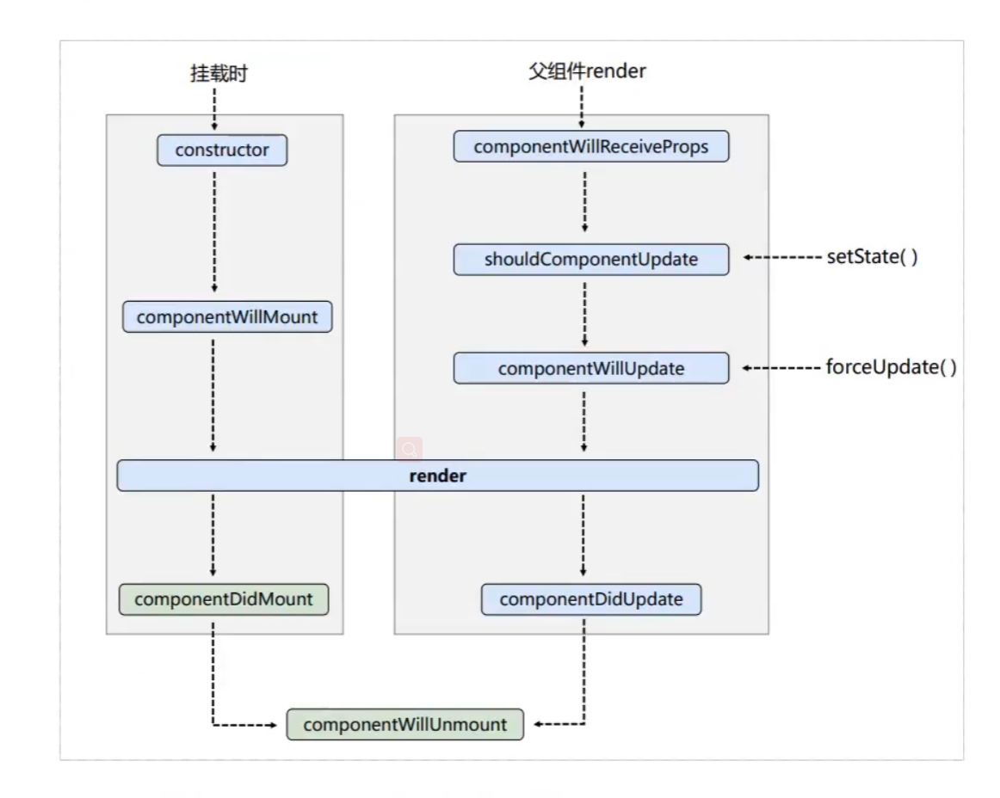

## 记忆点:
1. **[构造函数作用及传递props的作用,super函数不传props则在构造函数中无法使用this.props.](https://zh-hans.reactjs.org/docs/react-component.html#constructor)**
2. **[refs 内联函数,reRender的情况下,会被触发两次.](https://zh-hans.reactjs.org/docs/refs-and-the-dom.html)**
3. **[setState更新可能是异步的,不要直接依赖state与props数据做下一步更新,需回调形式调用.](https://zh-hans.reactjs.org/docs/state-and-lifecycle.html)**
4. **[事件函数中不能返回false阻止默认行为,需要显示调用preventDefault,并且所传递的事件对象与原生事对象不完全相同.](https://zh-hans.reactjs.org/docs/handling-events.html)**
5. **[传递事件对象: <button onClick={(e) => this.deleteRow(id, e)}>Delete Row</button>](https://zh-hans.reactjs.org/docs/handling-events.html)**
6. **[使用索引作为列表key的负面影响](https://robinpokorny.medium.com/index-as-a-key-is-an-anti-pattern-e0349aece318)**
7. **[key值在兄弟节点必须唯一,在全局不需要唯一](https://zh-hans.reactjs.org/docs/lists-and-keys.html)**
8. **[受控组件: 是指表单元素以react的state为唯一状态(value值受控制),并阻止其表单默认行为](https://zh-hans.reactjs.org/docs/forms.html)**
9. **[非受控组件: 是指表单元素value值不受控制,表单数据将交由 DOM 节点来处理](https://zh-hans.reactjs.org/docs/forms.html)**
## 16版本:
1. prop-types: 自 React v15.5 起，React.PropTypes 已移入另一个包中。请使用 prop-types 库 代替。
2. refs 字符串形式使用,性能不佳,会被弃用.
3. **[生命周期函数](https://projects.wojtekmaj.pl/react-lifecycle-methods-diagram/)**


```
    // 版本16.3,自上而下
    class React16 extends React.compenent{
        constructor(props) {
            super(props)
        }
        //
        static getDerivedStateFromProps(props, state) {
            return state;
        }
        
        // 获取新的props时触发,首次不触发
        componentWillReceiveProps(nextProps) {
        }
        
        // setState函数触发,需返回布尔值判断是否进入下一个钩子函数
        shouldComponentUpdate(nextProps, nextState) {
            return true;
        }
        
        render() {
            return (<div>render content</div>)
        }
    }
    // >= 16.4
```

## 17版本:


## 18版本:


